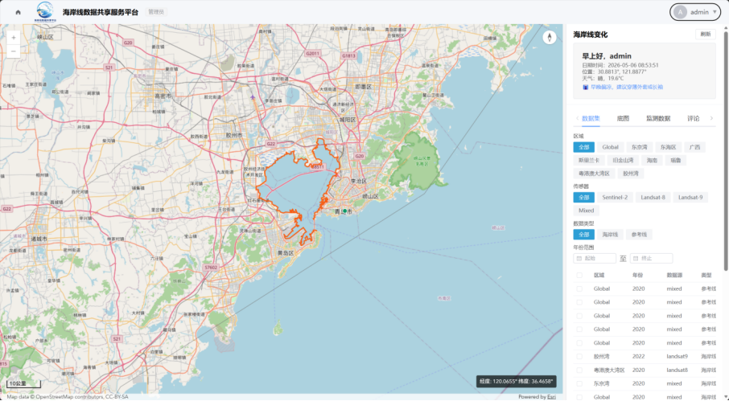
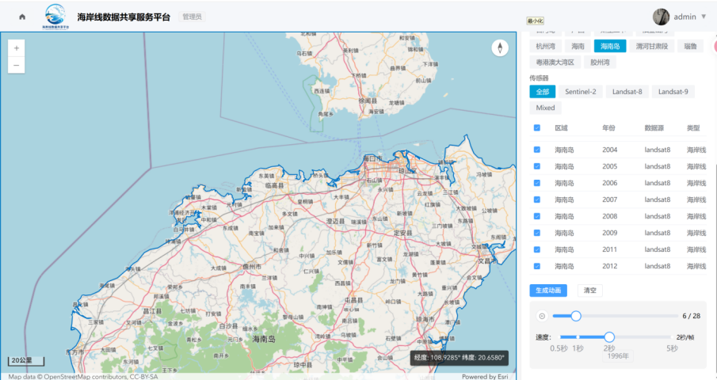
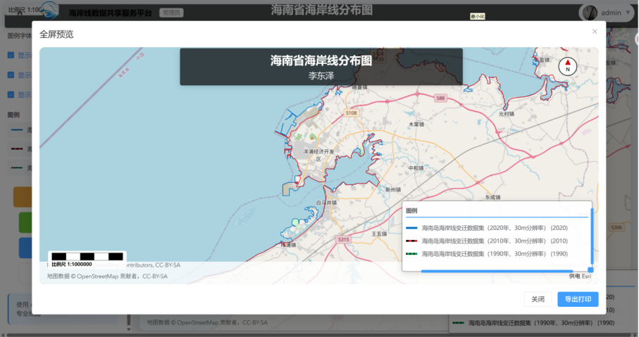
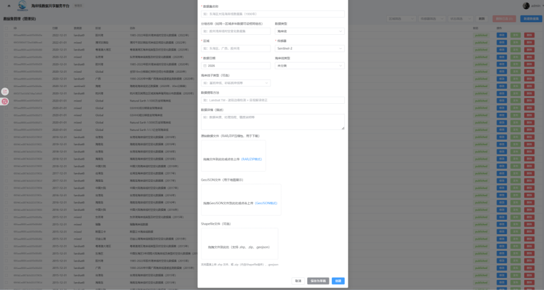
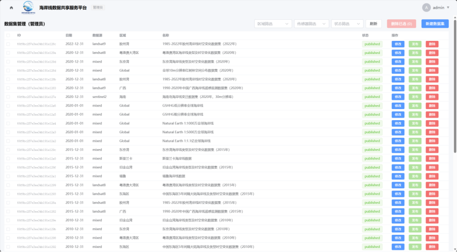
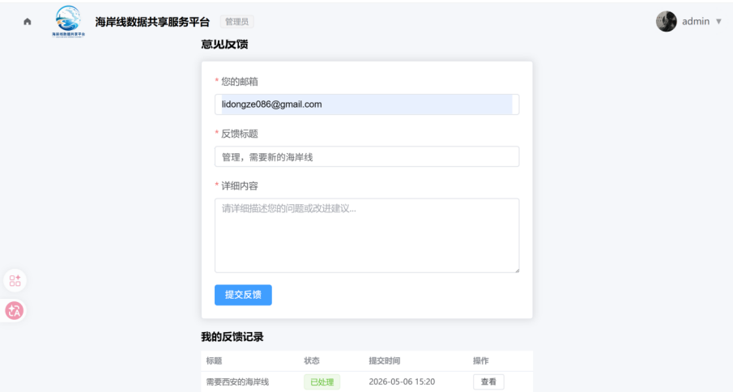

# 🌊 基于 WebGIS 的海岸线数据共享平台

一个前后端分离的海岸线数据管理与可视化平台，支持多期海岸线叠加展示、空间分析、海岸线演变动画与自定义高清出图。

## 技术栈

### 前端
| 技术 | 用途 |
|------|------|
| Vue 3 (Composition API + TypeScript) | 前端框架 |
| Element Plus | UI 组件库 |
| ArcGIS Maps SDK | 地图可视化与空间分析 |
| ECharts | 图表展示 |
| Vite | 构建工具 |
| Pinia | 状态管理 |
| Axios | HTTP 请求 |

### 后端
| 技术 | 用途 |
|------|------|
| Node.js + Express | 后端框架 |
| MongoDB + Mongoose | 数据库与 ODM |
| JWT (jsonwebtoken) | 用户认证 |
| Multer | 文件上传 |
| Turf.js | 空间分析 |
| Zod | API 参数校验 |
| Bcrypt | 密码加密 |
| adm-zip / shapefile | 压缩文件与 Shapefile 解析 |

### 数据来源
- [Science Data Bank](https://www.scidb.cn/)
- [全球变化科学研究数据出版系统](https://www.geodoi.ac.cn/)

## 功能概览

### 🗺️ 海岸线地图可视化
- 多期海岸线数据叠加显示
- 按区域、传感器、年份、数据类型筛选
- 点击要素查看详情（传感器、区域、方法等）
- 支持 LineString / MultiLineString 几何类型
- 多色区分不同数据集
- 

### 📐 空间分析工具
- 绘制工具：点、线、面、矩形、圆
- 海岸线长度量算（测地线）
- 面积量算（测地线）
- 缓冲区分析
- 空间相交筛选
- 海岸线变化对比（长度变化 / 变化率）

### 🎬 海岸线变化动画
- 同一区域多期数据一键生成演变动画
- 播放 / 暂停控制
- 帧滑动条
- 播放速度调节（0.5秒/帧 ~ 5秒/帧）
- 年份标签实时显示
- 循环播放
- 

### 🖼️ 自定义出图
- 支持 A4 / A3 纸张
- 输出格式：PDF / PNG / JPG
- 分辨率：96 / 150 / 300 DPI
- 自定义标题、图例、比例尺、指北针
- 拖拽调整地图、图例、比例尺位置
- 全屏预览模式
- 支持多数据集同时出图
- 

### 📂 数据管理
- 数据集列表展示与筛选
- 单个 / 批量加载海岸线
- 批量下载
- 数据上传（GeoJSON / Shapefile 格式）
- 数据集删除
- 
- 

### 💬 评论互动
- 嵌入式评论系统
- 评论与回复功能
- 自定义头像颜色
- 管理员评论管理
- 

### 👤 用户系统
- 注册 / 登录（JWT 认证）
- 个人信息管理
- 管理员后台
- 浏览历史记录

## 快速启动

### 环境要求
- Node.js >= 18
- MongoDB（本地或远程）

### 1. 安装依赖

```bash
# 后端
cd backend
npm install

# 前端
cd ../frontend
npm install
```

### 2. 配置环境变量

在 `backend` 目录创建 `.env`：

```env
MONGODB_URI=mongodb://localhost:27017/coastline
JWT_SECRET=your_jwt_secret_key
PORT=3001
CORS_ORIGIN=http://localhost:5173
```

### 3. 初始化数据

```bash
cd backend
npm run seed
```

### 4. 启动服务

```bash
# 终端1 - 后端
cd backend
npm run dev

# 终端2 - 前端
cd frontend
npm run dev
```

### 5. 访问
浏览器打开 `http://localhost:5173`

默认管理员可在 seed 脚本中配置。

## 项目结构

```
├── backend/                  # 后端
│   ├── src/
│   │   ├── index.js         # 入口文件
│   │   ├── middleware/       # 中间件（auth、角色校验）
│   │   ├── models/          # MongoDB 模型
│   │   ├── routes/          # API 路由
│   │   │   ├── datasets.js  # 数据集 CRUD + 分析接口
│   │   │   ├── auth.js      # 注册/登录
│   │   │   ├── comments.js  # 评论系统
│   │   │   ├── users.js     # 用户管理
│   │   │   ├── stations.js  # 监测站点
│   │   │   └── ...
│   │   └── lib/             # 工具函数
│   ├── scripts/seed.js      # 数据初始化脚本
│   └── public/              # 上传文件存储
├── frontend/                 # 前端
│   └── src/
│       ├── views/           # 页面组件
│       │   ├── MapPage.vue  # 主地图页面
│       │   ├── Login.vue    # 登录/注册
│       │   ├── ExportMapPage.vue  # 自定义出图
│       │   ├── Admin*.vue   # 管理后台
│       │   └── ...
│       ├── stores/          # Pinia 状态管理
│       ├── router/          # 路由配置
│       └── utils/           # 工具函数
└── data/                    # 测试数据（GeoJSON）
```

## API 概览

| 方法 | 路径 | 说明 |
|------|------|------|
| POST | /api/auth/register | 用户注册 |
| POST | /api/auth/login | 用户登录 |
| GET | /api/datasets | 获取数据集列表 |
| GET | /api/datasets/:id | 获取数据集详情 |
| GET | /api/datasets/:id/shoreline | 获取海岸线数据 |
| POST | /api/datasets | 上传数据集 |
| DELETE | /api/datasets/:id | 删除数据集 |
| GET | /api/comments/dataset/:id | 获取评论 |
| POST | /api/comments | 发表评论 |
| ... | ... | ... |

## 许可

本项目仅供学习与参考。
